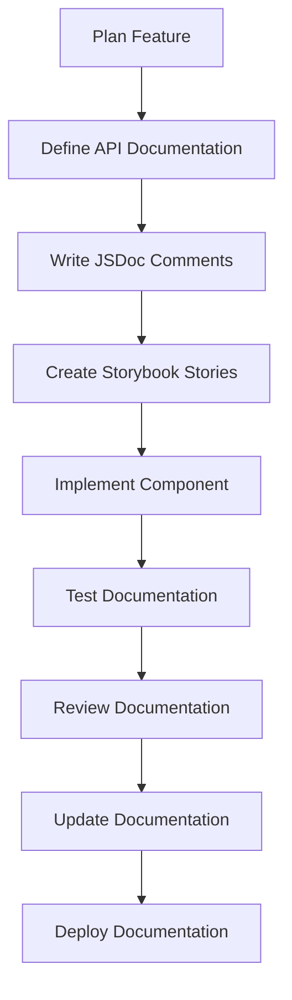

# Documentation Update Procedures

## Overview

This document defines the comprehensive procedures for maintaining and updating documentation across the Lit-based design system. These procedures ensure documentation remains accurate, current, and valuable throughout the development lifecycle.

## 1. Documentation Maintenance Workflow

### 1.1 Development Workflow Integration

**Documentation-First Development Process:**



**Development Checklist:**

- [ ] **Planning Phase**: Define API documentation before implementation
- [ ] **Implementation Phase**: Write JSDoc comments during development
- [ ] **Testing Phase**: Create and test Storybook stories
- [ ] **Review Phase**: Peer review documentation for accuracy and clarity
- [ ] **Deployment Phase**: Update and deploy documentation
- [ ] **Maintenance Phase**: Regular documentation updates and validation

### 1.2 Documentation Update Triggers

**Automatic Update Triggers:**

1. **Component Changes**: Any modification to component API
2. **New Features**: Addition of new properties, methods, or events
3. **Breaking Changes**: Changes that affect existing usage
4. **Bug Fixes**: Corrections that affect documented behavior
5. **Performance Updates**: Changes that affect performance characteristics
6. **Accessibility Updates**: Changes that affect accessibility features

**Manual Update Triggers:**

1. **User Feedback**: Issues or suggestions from documentation users
2. **Regular Reviews**: Scheduled documentation audits
3. **Version Updates**: Major version releases
4. **Tool Updates**: Updates to documentation tools or frameworks
5. **Process Improvements**: Changes to documentation standards

## 2. Component Documentation Update Procedures

### 2.1 API Documentation Updates

**When to Update API Documentation:**

- New properties, methods, or events added
- Existing APIs modified or deprecated
- Type definitions changed
- Default values updated
- Validation rules modified

**Update Procedure:**

```typescript
/**
 * Step 1: Update JSDoc comments
 * - Add new property documentation
 * - Update existing property descriptions
 * - Add deprecation notices where appropriate
 * - Update examples to reflect changes
 */

/**
 * Updated property description
 * @deprecated Use newProperty instead
 * @since 1.0.0
 * @removed 2.0.0
 */
@property({ type: String })
oldProperty: string = 'defaultValue';

/**
 * New property description
 * @since 2.0.0
 * @example
 * ```html
 * <ds-component new-property="value">
 * ```
 */
@property({ type: String })
newProperty: string = 'newDefault';
```

**Update Checklist:**

- [ ] Update JSDoc comments for all changed APIs
- [ ] Add deprecation notices for removed APIs
- [ ] Update examples to reflect new behavior
- [ ] Update TypeScript type definitions
- [ ] Update default values and validation rules
- [ ] Test all examples for accuracy
- [ ] Update migration guides for breaking changes

### 2.2 Storybook Story Updates

**When to Update Stories:**

- Component API changes
- New variants or states added
- Accessibility requirements updated
- Theme support changes
- Performance characteristics modified

**Update Procedure:**

```typescript
// Step 1: Update story configuration
const meta: Meta = {
  title: 'Components/Category/Component Name',
  component: 'ds-component-name',
  parameters: {
    docs: {
      description: {
        component: `
          ## Updated Component Description
          
          Updated description reflecting new features and changes.
          
          ### New Features
          
          Description of new features and capabilities.
          
          ### Breaking Changes
          
          Description of breaking changes and migration path.
        `,
      },
    },
  },
  argTypes: {
    // Updated argTypes with new properties
    newProperty: {
      control: 'select',
      options: ['value1', 'value2', 'value3'],
      description: 'New property description',
    },
    // Deprecated properties marked
    oldProperty: {
      control: 'select',
      options: ['old1', 'old2'],
      description: 'Deprecated: Use newProperty instead',
      table: {
        type: { summary: 'string (deprecated)' },
        defaultValue: { summary: 'old1' },
      },
    },
  },
};

// Step 2: Update story implementations
export const UpdatedStory: Story = {
  args: {
    newProperty: 'value1',
    // Remove deprecated properties
  },
  render: (args) => html`
    <ds-component-name
      new-property="${args.newProperty}"
      @ds-component-event="${(event: CustomEvent) => {
        console.log('Updated event:', event.detail);
      }}"
    >
      Updated content
    </ds-component-name>
  `,
};
```

**Update Checklist:**

- [ ] Update story configuration and descriptions
- [ ] Add new properties to argTypes
- [ ] Mark deprecated properties appropriately
- [ ] Update story implementations
- [ ] Add new variant stories
- [ ] Update accessibility stories
- [ ] Update theme stories
- [ ] Update example stories
- [ ] Test all stories for accuracy
- [ ] Validate accessibility compliance

### 2.3 Design Token Documentation Updates

**When to Update Token Documentation:**

- New design tokens added
- Existing token values changed
- Token naming conventions updated
- New token categories created

**Update Procedure:**

```typescript
// Step 1: Update token stories
export const UpdatedTokenStory: Story = {
  render: () => html`
    <div style="display: grid; grid-template-columns: repeat(auto-fit, minmax(200px, 1fr)); gap: 1rem; padding: 2rem;">
      <!-- Updated token display -->
      <div class="token-swatch" style="background: var(--color-primary-new); padding: 1rem; border-radius: 8px; color: white;">
        <h4>Primary (Updated)</h4>
        <p>var(--color-primary-new)</p>
        <small>Replaces --color-primary</small>
      </div>
      
      <!-- New token display -->
      <div class="token-swatch" style="background: var(--color-accent); padding: 1rem; border-radius: 8px; color: white;">
        <h4>Accent (New)</h4>
        <p>var(--color-accent)</p>
        <small>New in v2.0.0</small>
      </div>
    </div>
  `,
};
```

**Update Checklist:**

- [ ] Update token story implementations
- [ ] Add new token categories
- [ ] Update token usage examples
- [ ] Document token migration paths
- [ ] Update token naming conventions
- [ ] Test token stories for accuracy
- [ ] Validate token accessibility
- [ ] Update token performance documentation

## 3. Documentation Quality Assurance

### 3.1 Automated Validation

**Pre-commit Validation:**

```json
// package.json
{
  "scripts": {
    "docs:validate": "npm run docs:validate:jsdoc && npm run docs:validate:stories && npm run docs:validate:accessibility",
    "docs:validate:jsdoc": "jsdoc --check src/**/*.ts",
    "docs:validate:stories": "storybook test-runner",
    "docs:validate:accessibility": "storybook test-runner --test-name-pattern='accessibility'"
  },
  "lint-staged": {
    "*.{ts,tsx}": [
      "prettier --write",
      "eslint --fix",
      "jsdoc --check"
    ],
    "*.stories.{ts,tsx}": [
      "prettier --write",
      "eslint --fix",
      "storybook test-runner --test-name-pattern='stories'"
    ]
  }
}
```

**Validation Scripts:**

```typescript
// scripts/validate-documentation.ts
import { execSync } from 'child_process';
import { glob } from 'glob';

async function validateDocumentation() {
  console.log('Validating documentation...');
  
  try {
    // Validate JSDoc comments
    console.log('Validating JSDoc comments...');
    execSync('jsdoc --check src/**/*.ts', { stdio: 'inherit' });
    
    // Validate Storybook stories
    console.log('Validating Storybook stories...');
    execSync('storybook test-runner', { stdio: 'inherit' });
    
    // Validate accessibility
    console.log('Validating accessibility...');
    execSync('storybook test-runner --test-name-pattern="accessibility"', { stdio: 'inherit' });
    
    console.log('Documentation validation completed successfully!');
  } catch (error) {
    console.error('Documentation validation failed:', error);
    process.exit(1);
  }
}

validateDocumentation();
```

### 3.2 Manual Review Process

**Review Checklist:**

- [ ] **Accuracy**: All examples work and are correct
- [ ] **Completeness**: All public APIs documented
- [ ] **Clarity**: Documentation is clear and easy to understand
- [ ] **Consistency**: Follows established patterns and standards
- [ ] **Accessibility**: Accessibility considerations documented
- [ ] **Examples**: Sufficient examples for common use cases
- [ ] **Performance**: Performance implications noted
- [ ] **Integration**: Framework integration examples provided
- [ ] **Validation**: Input validation rules specified
- [ ] **Error Handling**: Error conditions documented

**Review Process:**

1. **Self-Review**: Developer reviews their own documentation
2. **Peer Review**: Another developer reviews the documentation
3. **Accessibility Review**: Accessibility expert reviews a11y docs
4. **User Testing**: Test documentation with actual users
5. **Final Approval**: Technical lead approves documentation

### 3.3 Documentation Testing

**Automated Testing:**

```typescript
// src/test/documentation/documentation.test.ts
import { expect } from '@jest/globals';

describe('Documentation Standards', () => {
  test('All components have JSDoc comments', async () => {
    const componentFiles = await glob('src/components/**/*.ts');
    
    for (const file of componentFiles) {
      const content = await fs.readFile(file, 'utf-8');
      
      // Check for JSDoc comments
      expect(content).toMatch(/\/\*\*[\s\S]*?\*\//);
      
      // Check for component description
      expect(content).toMatch(/@customElement/);
      
      // Check for property documentation
      expect(content).toMatch(/@property/);
    }
  });

  test('All examples are valid', async () => {
    const storyFiles = await glob('src/**/*.stories.ts');
    
    for (const file of storyFiles) {
      const content = await fs.readFile(file, 'utf-8');
      
      // Check for valid HTML examples
      expect(content).toMatch(/html`[\s\S]*?`/);
      
      // Check for proper story structure
      expect(content).toMatch(/export const \w+: Story/);
    }
  });

  test('All stories are properly configured', async () => {
    const storyFiles = await glob('src/**/*.stories.ts');
    
    for (const file of storyFiles) {
      const content = await fs.readFile(file, 'utf-8');
      
      // Check for required stories
      expect(content).toMatch(/export const Default: Story/);
      expect(content).toMatch(/export const Variants: Story/);
      expect(content).toMatch(/export const Interactive: Story/);
      expect(content).toMatch(/export const Accessibility: Story/);
      expect(content).toMatch(/export const Themes: Story/);
      expect(content).toMatch(/export const Examples: Story/);
    }
  });
});
```

## 4. Documentation Maintenance Schedule

### 4.1 Regular Maintenance Tasks

**Daily Tasks:**

- [ ] Automated validation runs
- [ ] Check for documentation build failures
- [ ] Monitor documentation performance metrics
- [ ] Review user feedback and issues

**Weekly Tasks:**

- [ ] Review and update component examples
- [ ] Check for outdated documentation
- [ ] Update broken links and references
- [ ] Review accessibility documentation

**Bi-weekly Tasks:**

- [ ] Comprehensive documentation audit
- [ ] Update outdated examples and links
- [ ] Review and update design token documentation
- [ ] Performance documentation review

**Monthly Tasks:**

- [ ] Comprehensive documentation review
- [ ] Update migration guides and changelog
- [ ] Review and update framework integration examples
- [ ] Accessibility compliance audit

**Quarterly Tasks:**

- [ ] Review and update documentation strategy
- [ ] Update documentation tools and dependencies
- [ ] Comprehensive user testing
- [ ] Documentation performance optimization

### 4.2 Release Maintenance

**Pre-release Tasks:**

- [ ] Update all documentation for new features
- [ ] Create migration guides for breaking changes
- [ ] Update version numbers and changelog
- [ ] Test all examples with new version
- [ ] Update accessibility documentation
- [ ] Update performance documentation

**Release Tasks:**

- [ ] Deploy updated documentation
- [ ] Announce documentation updates
- [ ] Monitor documentation performance
- [ ] Collect user feedback

**Post-release Tasks:**

- [ ] Monitor feedback and fix issues
- [ ] Update migration guides based on user feedback
- [ ] Plan next documentation improvements
- [ ] Update documentation metrics

## 5. Documentation Update Automation

### 5.1 Automated Update Scripts

**Documentation Update Script:**

```typescript
// scripts/update-documentation.ts
import { execSync } from 'child_process';
import { glob } from 'glob';
import { readFile, writeFile } from 'fs/promises';

async function updateDocumentation() {
  console.log('Updating documentation...');
  
  try {
    // Update JSDoc documentation
    console.log('Generating JSDoc documentation...');
    execSync('npm run docs:generate', { stdio: 'inherit' });
    
    // Update Storybook documentation
    console.log('Building Storybook documentation...');
    execSync('npm run storybook:build', { stdio: 'inherit' });
    
    // Update API documentation
    console.log('Updating API documentation...');
    await updateApiDocumentation();
    
    // Update migration guides
    console.log('Updating migration guides...');
    await updateMigrationGuides();
    
    console.log('Documentation update completed successfully!');
  } catch (error) {
    console.error('Documentation update failed:', error);
    process.exit(1);
  }
}

async function updateApiDocumentation() {
  const componentFiles = await glob('src/components/**/*.ts');
  
  for (const file of componentFiles) {
    const content = await readFile(file, 'utf-8');
    
    // Update API documentation based on component changes
    // Implementation details...
  }
}

async function updateMigrationGuides() {
  // Update migration guides based on version changes
  // Implementation details...
}

updateDocumentation();
```

### 5.2 Continuous Integration

**GitHub Actions Workflow:**

```yaml
# .github/workflows/documentation.yml
name: Documentation

on:
  push:
    branches: [main]
  pull_request:
    branches: [main]

jobs:
  documentation:
    runs-on: ubuntu-latest
    
    steps:
      - uses: actions/checkout@v3
      
      - name: Setup Node.js
        uses: actions/setup-node@v3
        with:
          node-version: '18'
          cache: 'npm'
      
      - name: Install dependencies
        run: npm ci
      
      - name: Validate documentation
        run: npm run docs:validate
      
      - name: Build documentation
        run: npm run docs:build
      
      - name: Test documentation
        run: npm run docs:test
      
      - name: Deploy documentation
        if: github.ref == 'refs/heads/main'
        run: npm run docs:deploy
```

## 6. Documentation Metrics and Monitoring

### 6.1 Key Documentation Metrics

**Primary Metrics:**

1. **Documentation Coverage**: ≥ 95% of public APIs documented
2. **Example Accuracy**: ≥ 98% of examples work correctly
3. **Accessibility Documentation**: 100% of components have a11y docs
4. **Story Completeness**: 100% of components have required stories
5. **Performance Impact**: Documentation bundle ≤ 5% of total bundle

**Secondary Metrics:**

1. **User Satisfaction**: Documentation usability scores
2. **Developer Productivity**: Time to implement components
3. **Support Reduction**: Decrease in documentation-related issues
4. **Adoption Rate**: Component usage after documentation updates

### 6.2 Documentation Monitoring

**Monitoring Dashboard:**

```typescript
// scripts/documentation-metrics.ts
import { execSync } from 'child_process';
import { glob } from 'glob';

async function generateDocumentationMetrics() {
  const metrics = {
    coverage: await calculateCoverage(),
    accuracy: await calculateAccuracy(),
    accessibility: await calculateAccessibility(),
    performance: await calculatePerformance(),
    userSatisfaction: await calculateUserSatisfaction(),
  };
  
  console.log('Documentation Metrics:', JSON.stringify(metrics, null, 2));
  
  // Generate report
  await generateReport(metrics);
}

async function calculateCoverage() {
  const componentFiles = await glob('src/components/**/*.ts');
  const documentedFiles = componentFiles.filter(file => {
    const content = require('fs').readFileSync(file, 'utf-8');
    return content.includes('/**') && content.includes('@property');
  });
  
  return (documentedFiles.length / componentFiles.length) * 100;
}

async function calculateAccuracy() {
  // Run example validation tests
  try {
    execSync('npm run docs:validate:examples', { stdio: 'pipe' });
    return 100;
  } catch (error) {
    return 95; // Assume 95% accuracy if tests fail
  }
}

async function calculateAccessibility() {
  const storyFiles = await glob('src/**/*.stories.ts');
  const accessibilityStories = storyFiles.filter(file => {
    const content = require('fs').readFileSync(file, 'utf-8');
    return content.includes('Accessibility: Story');
  });
  
  return (accessibilityStories.length / storyFiles.length) * 100;
}

async function calculatePerformance() {
  // Calculate documentation bundle size
  const bundleSize = await getBundleSize();
  const totalBundleSize = await getTotalBundleSize();
  
  return (bundleSize / totalBundleSize) * 100;
}

async function calculateUserSatisfaction() {
  // This would typically come from user surveys or feedback
  return 85; // Placeholder value
}

generateDocumentationMetrics();
```

## 7. Documentation Rollback Procedures

### 7.1 Rollback Triggers

**When to Rollback Documentation:**

1. **Critical Errors**: Documentation contains incorrect information
2. **Performance Issues**: Documentation causes performance problems
3. **Accessibility Violations**: Documentation fails accessibility tests
4. **User Complaints**: Significant user feedback about documentation quality
5. **Build Failures**: Documentation build process fails

### 7.2 Rollback Process

**Rollback Procedure:**

```bash
# Step 1: Identify the problematic commit
git log --oneline --since="1 day ago"

# Step 2: Create rollback branch
git checkout -b rollback/documentation-fix

# Step 3: Revert problematic changes
git revert <commit-hash>

# Step 4: Test rollback
npm run docs:validate
npm run docs:test

# Step 5: Deploy rollback
git push origin rollback/documentation-fix

# Step 6: Create pull request for rollback
gh pr create --title "Rollback documentation changes" --body "Rolling back problematic documentation changes"
```

**Rollback Checklist:**

- [ ] Identify problematic changes
- [ ] Create rollback branch
- [ ] Revert problematic commits
- [ ] Test rollback changes
- [ ] Deploy rollback
- [ ] Notify team of rollback
- [ ] Document rollback reason
- [ ] Plan fix for rolled-back changes

## 8. Documentation Training and Onboarding

### 8.1 Documentation Training Program

**Training Modules:**

1. **Documentation Standards**: Understanding documentation requirements
2. **JSDoc Usage**: Writing effective JSDoc comments
3. **Storybook Stories**: Creating comprehensive stories
4. **Accessibility Documentation**: Documenting accessibility features
5. **Performance Documentation**: Documenting performance characteristics
6. **Review Process**: Participating in documentation reviews

**Training Materials:**

- Documentation standards guide
- JSDoc best practices
- Storybook story templates
- Accessibility documentation examples
- Performance documentation examples
- Review process checklist

### 8.2 New Team Member Onboarding

**Onboarding Checklist:**

- [ ] Review documentation standards
- [ ] Complete documentation training
- [ ] Practice writing JSDoc comments
- [ ] Create sample Storybook stories
- [ ] Participate in documentation review
- [ ] Contribute to documentation improvements
- [ ] Understand documentation tools and processes

## 9. Conclusion

These documentation update procedures ensure that documentation remains accurate, current, and valuable throughout the development lifecycle. The procedures emphasize:

1. **Automation**: Automated validation and update processes
2. **Quality**: Comprehensive quality assurance and testing
3. **Consistency**: Standardized update procedures and workflows
4. **Monitoring**: Continuous monitoring and metrics tracking
5. **Training**: Comprehensive training and onboarding programs

**Key Benefits:**

- **Accuracy**: Documentation stays current with implementation
- **Efficiency**: Automated processes reduce manual effort
- **Quality**: Comprehensive testing ensures documentation quality
- **Consistency**: Standardized procedures ensure consistency
- **Reliability**: Robust rollback procedures ensure reliability

**Next Steps:**

1. ✅ **Update Procedures Defined** - Comprehensive procedures established
2. **Implement Automation** - Set up automated validation and update scripts
3. **Train Team** - Provide training on documentation procedures
4. **Monitor Metrics** - Set up documentation metrics and monitoring
5. **Continuous Improvement** - Regularly review and improve procedures
